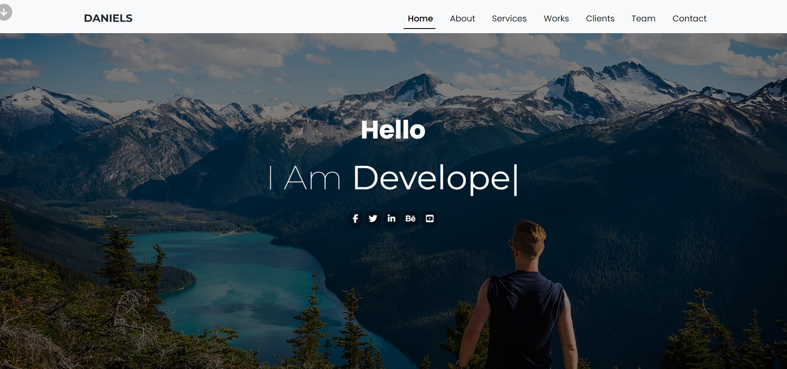

# Daniels Portfolio

Daniels Portfolio is a personal website for Jerry Daniels, a UI/UX designer and web developer. The site showcases his skills, services, portfolio of works, client testimonials, team members, and provides a contact form for potential clients.

## Features

- Responsive navigation bar with smooth scrolling to sections.
- Hero section with social media links.
- About section with a brief bio and skill progress bars.
- Services section highlighting the services offered.
- Portfolio section with tabbed filtering for different categories of work.
- Testimonials section with a carousel of client feedback.
- Team section displaying team members with social media links.
- Contact section with a form for inquiries.
- Fully responsive design using Bootstrap.

## Technologies Used

- HTML5
- CSS3
- JavaScript
- [Bootstrap 5.3.3](https://getbootstrap.com/)
- [Font Awesome 6.7.2](https://fontawesome.com/)
- [Google Fonts](https://fonts.google.com/)

## Setup and Installation

1. Clone the repository or download the project files.
2. Open the `index.html` file in a web browser to view the site locally.
3. Alternatively, deploy the files to a web server for online access.

No additional dependencies are required as all libraries are included via CDNs.

## Usage

- Navigate through the site using the top navigation bar.
- Click on the portfolio tabs to filter works by category.
- Use the carousel indicators to switch between testimonials.
- The contact form is for demonstration purposes and does not send actual messages without a backend setup.

## Project Structure

- `index.html`: The main HTML file.
- `assets/CSS/main.css`: Custom CSS styles.
- `assets/Images/`: Folder containing all images used in the site, including the screenshot.

The site uses Bootstrap for layout and responsiveness, with custom styles in `main.css` to override or extend Bootstrap's default styles.

## Screenshot

Below is a screenshot of the Daniels Portfolio homepage:

## Live Demo

You can view a live demo of the portfolio site [**here**](https://eng-ahmed-hussien.github.io/Daniels-Portfolio/).  

## Notes

- The contact form is for demonstration purposes only and does not send actual messages. To make it functional, a backend service or script is required to handle form submissions.

## License

This project is proprietary and not licensed for reuse. All rights are reserved by A7med Hussien.

## Contact

For any inquiries or issues regarding the code, please contact me on [**Gmail**](ahmedhussien1352@gmail.com).